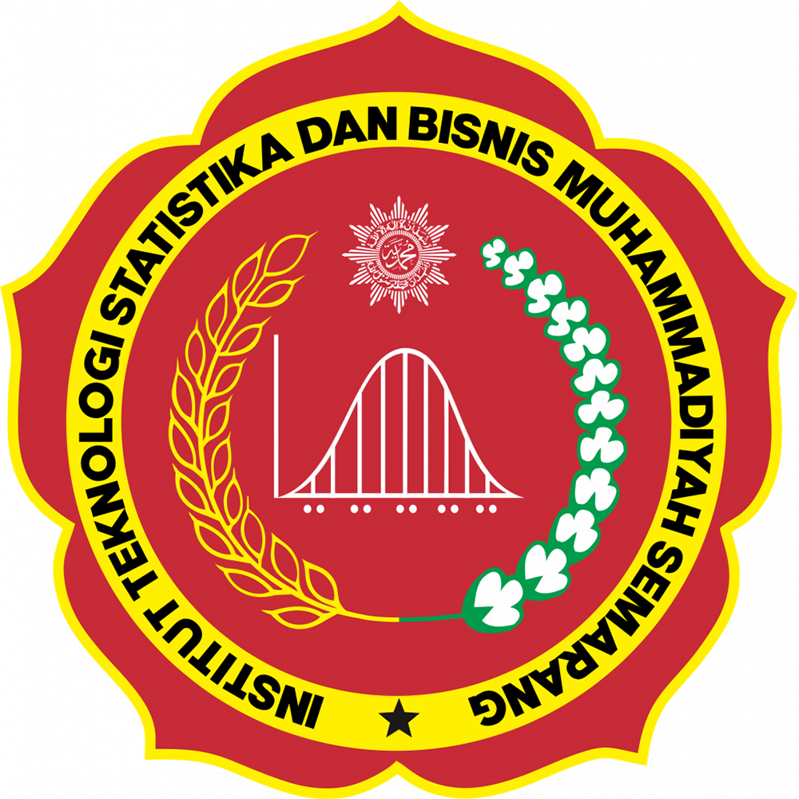
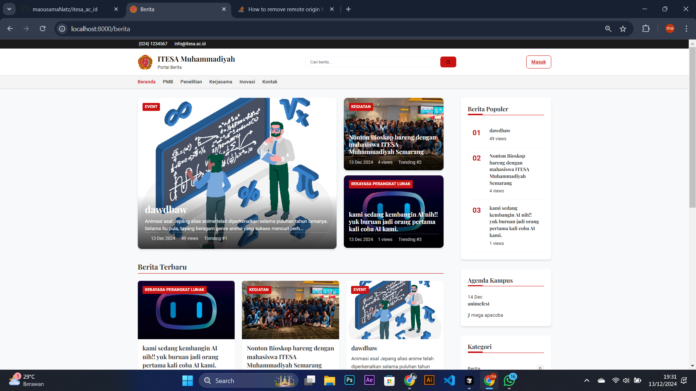

    

# ITESA News Portal

## Tentang Project
ITESA News Portal adalah platform berita dan informasi resmi Institut ITESA Muhammadiyah. Portal ini dirancang untuk menyajikan berita terkini, agenda kampus, dan informasi penting lainnya seputar ITERA. Sistem ini memungkinkan pengelolaan konten yang efisien dengan fitur admin panel yang komprehensif.

### Fitur Utama
- Manajemen Artikel & Berita
- Pengelolaan Agenda Kampus
- Sistem Kategori & Tag
- Dashboard Admin
- Manajemen Media
- SEO Friendly

## Teknologi yang Digunakan
- **Framework:** 
    Laravel 10.x
- **Database:** 
    MySQL
- **Frontend:** 
  - HTML5
  - CSS3
  - JavaScript
  - Bootstrap 5
  - TailwindCSS
- **Library & Tools:**
  - jQuery
  - AJAX
  - Laravel Mix
  - NPM
  - Git
- **Server Requirements:**
  - PHP >= 8.1
  - Composer
  - Node.js & NPM
  - MySQL >= 5.7

## Instalasi

1. Clone repository
``bash
git clone https://github.com/maousamaNatz/itesa_ac_id.git
cd itesa-news-portal
``
2. Install dependencies

``bash
composer install
npm install
``

3. Setup environment

``bash
cp .env.example .env
php artisan key:generate
``

4. Konfigurasi database di file .env

``bash
DB_CONNECTION=mysql
DB_HOST=127.0.0.1
DB_PORT=3306
DB_DATABASE=itesa_db
DB_USERNAME=root
DB_PASSWORD=
``

5. Migrasi dan seed database

``bash
php artisan migrate --seed
``

6. Compile assets

``bash
npm run dev
``

7. Jalankan server

``bash
php artisan serve
``

## Struktur Database

### 1. Tabel Users
- id (primary key)
- name
- email
- password
- role
- created_at
- updated_at

### 2. Tabel Articles
- id (primary key)
- title
- slug
- content
- thumbnail
- meta_title
- meta_description
- meta_keyword
- author_id (foreign key)
- category_id (foreign key)
- status
- views
- published_at
- created_at
- updated_at

### 3. Tabel Categories
- id (primary key)
- name
- slug
- description
- image
- created_at
- updated_at

### 4. Tabel Tags
- id (primary key)
- name
- slug
- created_at
- updated_at

### 5. Tabel Article_Tags
- id (primary key)
- article_id (foreign key)
- tag_id (foreign key)
- created_at
- updated_at

### 6. Tabel Agendas
- id (primary key)
- title
- description
- start_date
- end_date
- location
- status
- created_by (foreign key)
- created_at
- updated_at

### Author

**Ridho Toti febianto**
- Role: Frontend fakultas
- Email: 
- GitHub: [@SkyDcode](https://github.com/SkyyDcode)

**Natanael Ben Iriyanto (Natzsixn)**
- Role: Frontend Dashboard Itesa.ac.id, Frontends Berita itesa.ac.id, Backend project itesa.ac.id
- Email: natzsixnismynames@gmail.com
- GitHub: [@natzsixn](https://github.com/maousamanatz)

**Haidar rifky andriano**
- Role: frontend home page itesa
- Email: 
- GitHub: [@Hackivers](https://github.com/Hackivers)

## Penutup

Project ini dikembangkan sebagai bagian dari sistem informasi ITESA Muhammadiyah. Untuk informasi lebih lanjut atau melaporkan bug, silakan buat issue di repository ini atau hubungi tim pengembang.

### Lisensi
Project ini dilindungi hak cipta dan merupakan properti dari Institut Teknologi ITESA Muhammadiyah.

### Kontribusi
Untuk berkontribusi pada project ini, silakan buat pull request atau hubungi tim pengembang.
